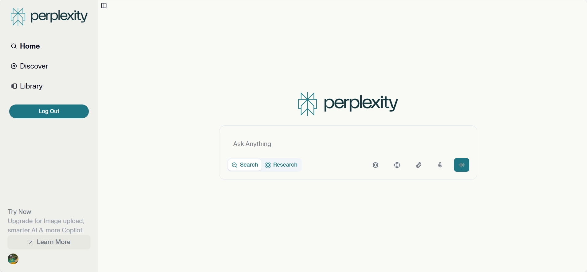
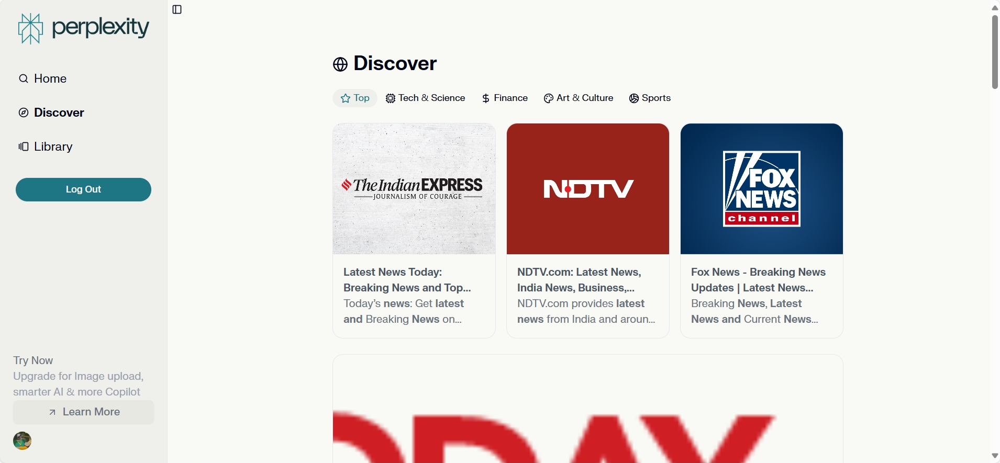
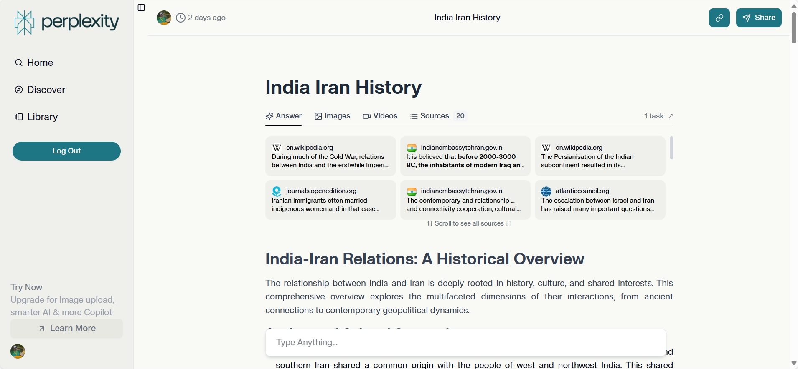
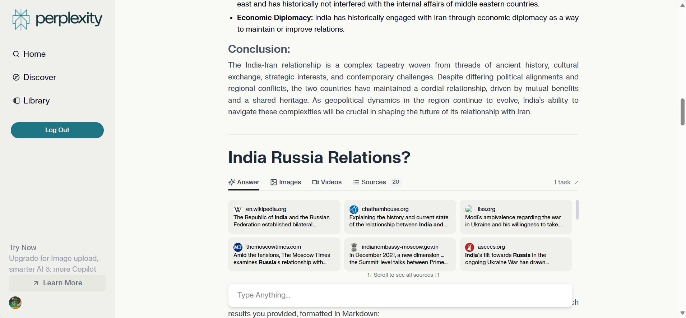
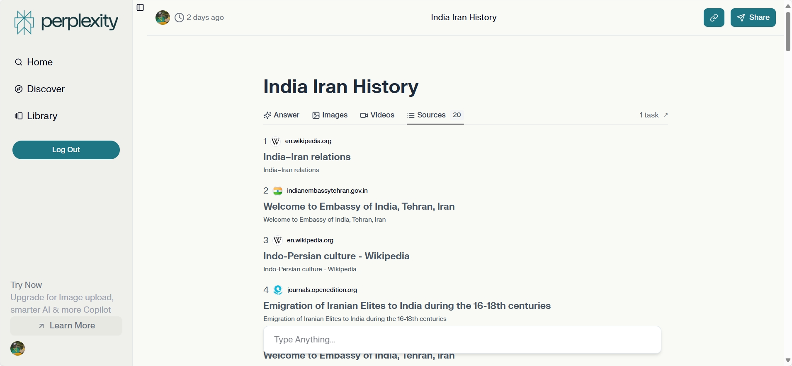
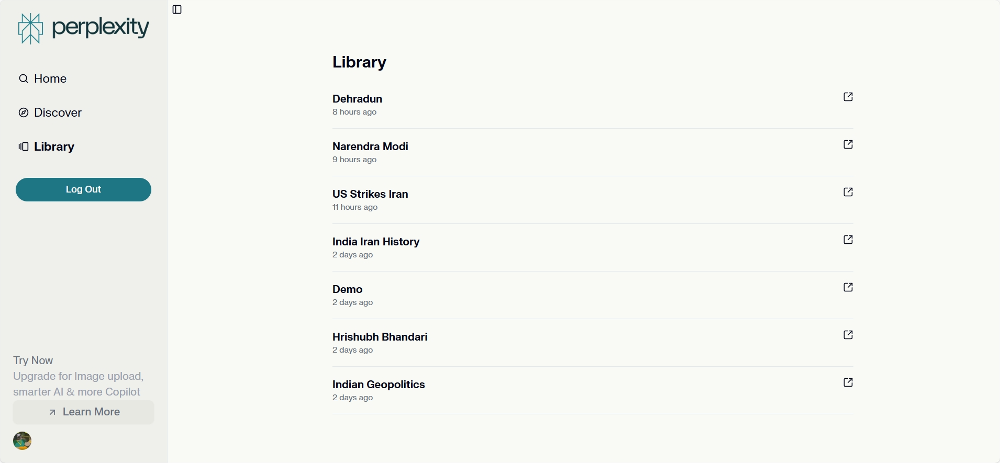

# 🔍 Perplexity AI Clone

> **A sophisticated AI-powered search engine that combines real-time web search with intelligent content summarization, built with modern web technologies and advanced AI integration.**


## 🚀 Live Demo
**[https://perplexity-ai-clone-theta.vercel.app/](https://perplexity-ai-clone-theta.vercel.app/)**

## 📋 Table of Contents

- [Overview](#-overview)
- [Key Features](#-key-features)
- [Technology Stack](#-technology-stack)
- [Architecture](#-architecture)
- [Installation](#-installation)
- [Usage](#-usage)
- [API Integration](#-api-integration)
- [Database Schema](#-database-schema)
- [Performance Optimizations](#-performance-optimizations)
- [Contributing](#-contributing)
- [License](#-license)

<!-- Below Performance Optimization -->
<!-- - [Security Features](#-security-features) -->
<!-- - [Future Enhancements](#-future-enhancements) -->


## 🎯 Overview

This project is a full-featured clone of Perplexity AI, demonstrating advanced full-stack development capabilities. It combines real-time web search with AI-powered content analysis to provide intelligent, comprehensive answers to user queries.

### What Makes This Project Special

- **Real-time Search Integration**: Leverages Brave Search API for up-to-date information
- **AI-Powered Summarization**: Uses Google's Gemini 2.0 Flash for intelligent content processing
- **Asynchronous Processing**: Background job processing with Inngest for optimal performance
- **Modern UI/UX**: Responsive design with advanced loading states and animations
- **Scalable Architecture**: Microservices approach with separated concerns

## 🖼 Screenshots

Below are some screenshots demonstrating the main features and UI of the Perplexity AI Clone:

### Home Screen

*The landing page with a clean, modern interface for starting your search.*

### Discovery Page

*Browse trending topics and categories for inspiration and exploration.*

### Chat Screen

*Interactive chat interface for asking questions and receiving AI-powered answers.*

### Continuous Thread

*Seamless conversation flow with persistent chat history.*

### Chat Sources

*View sources and references for AI-generated answers, ensuring transparency.*

### Library

*Organized storage of your previous searches and responses for easy access.*

## ✨ Key Features

### 🔍 **Intelligent Search**
- Real-time web search (Brave API) with AI summarization
- Multi-format results (web, images, videos, news)
- Category-based discovery (Tech, Finance, Sports, etc.)
- Advanced filtering and sorting capabilities

### 🤖 **AI-Powered Analysis**
- **Gemini 2.0 Flash Integration**: Latest Google AI model for content processing
- **Background Processing**: Non-blocking AI operations with Inngest
- **Rich Content Formatting**: Markdown rendering with syntax highlighting

### 🎨 **Modern User Interface**
- **Responsive Design**: Mobile-first approach with Tailwind CSS
- **Tabbed Interface**: Organized content display (Answer, Images, Videos, Sources)
- **Real-time Loading States**: Skeleton loaders and progress indicators
- **Interactive Components**: Advanced UI components with Radix UI

### 💾 **Data Management**
- **Supabase Integration**: PostgreSQL backend with real-time capabilities
- **Chat History**: Persistent conversation storage
- **Library Management**: Organized query and response storage
- **User Authentication**: Secure user management with Clerk

## 🛠 Technology Stack

### **Frontend**
- **Next.js 15.3.3** - React framework with App Router
- **React 19.0.0** - Latest React with concurrent features
- **Tailwind CSS 4.0** - Utility-first CSS framework
- **Radix UI** - Accessible component primitives
- **Lucide React** - Beautiful icon library

### **Backend & APIs**
- **Brave Search API** - Real-time web search
- **Google Gemini 2.0 Flash** - AI content processing
- **Inngest** - Background job processing
- **Supabase** - Database and authentication
- **Clerk** - User authentication and management

### **Development Tools**
- **TypeScript** - Type-safe development
- **ESLint** - Code quality and consistency
- **PostCSS** - CSS processing
- **UUID** - Unique identifier generation

## 🏗 System Architecture

The application follows a modern, scalable architecture:

```
┌─────────────────┐    ┌─────────────────┐     ┌─────────────────┐
│   Frontend      │    │   API Layer     │────►│   AI Processing │
│   (Next.js)     │───►│   (Route.js)    │  ┌─►│   (Inngest)     │
└─────────────────┘    └─────────────────┘  │  └─────────────────┘
         │                       │          │           │
         ▼                       ▼          │           ▼
┌─────────────────┐    ┌─────────────────┐  │  ┌─────────────────┐
│   UI Components │    │   Brave API     │  │  │   Gemini AI     │
│   (React)       │    │   (Search)      │  │  │   (Processing)  │
└─────────────────┘    └─────────────────┘  │  └─────────────────┘
         │                       │          │           │
         ▼                       ▼          │           ▼
┌─────────────────┐    ┌─────────────────┐  │  ┌─────────────────┐
│   State Mgmt    │    │   Database      │──┘  │   Authentication│
│   (Context)     │    │   (Supabase)    │     │   (Clerk)       │
└─────────────────┘    └─────────────────┘     └─────────────────┘
```

### **Data Flow**
1. **User Input** → Search query submission
2. **Brave API** → Real-time web search results
3. **Database Storage** → Search results and metadata
4. **AI Processing** → Background Gemini analysis
5. **Response Generation** → Formatted markdown content
6. **UI Update** → Real-time display with loading states

## 🚀 Installation

### Prerequisites
- Node.js 18+ 
- npm or yarn
- Supabase account
- Brave Search API key
- Google Gemini API key
- Clerk account

### Setup Instructions

1. **Clone the repository**
   ```bash
   git clone https://github.com/Hrishubh/perplexity-ai-clone.git
   cd perplexity-ai-clone
   ```

2. **Install dependencies**
   ```bash
   npm install
   ```

3. **Environment Configuration**
   Create a `.env.local` file with the following variables:
   ```env
   # Supabase Configuration
   NEXT_PUBLIC_SUPABASE_URL=your_supabase_url
   NEXT_PUBLIC_SUPABASE_KEY=your_supabase_anon_key
   
   # API Keys
   NEXT_PUBLIC_BRAVE_API_KEY=your_brave_api_key
   NEXT_PUBLIC_GEMINI_API_KEY=your_gemini_api_key
   
   # Authentication
   NEXT_PUBLIC_CLERK_PUBLISHABLE_KEY=your_clerk_publishable_key
   CLERK_SECRET_KEY=your_clerk_secret_key
   
   # Inngest Configuration
   INNGEST_EVENT_KEY=your_inngest_event_key
   INNGEST_SIGNING_KEY=your_inngest_signing_key
   ```

4. **Database Setup**
   ```sql
   -- Create Library table
   CREATE TABLE Library (
     id SERIAL PRIMARY KEY,
     libId UUID UNIQUE NOT NULL,
     searchInput TEXT NOT NULL,
     userEmail TEXT,
     type TEXT DEFAULT 'search',
     created_at TIMESTAMP DEFAULT NOW()
   );

   -- Create Chats table
   CREATE TABLE Chats (
     id SERIAL PRIMARY KEY,
     libId UUID REFERENCES Library(libId),
     searchResult JSONB,
     userSearchInput TEXT,
     aiResp TEXT,
     created_at TIMESTAMP DEFAULT NOW()
   );
   ```

5. **Run the development server**
```bash
npm run dev
   ```

6. **Open your browser**
   Navigate to [http://localhost:3000](http://localhost:3000)

## 📖 Usage

### **Basic Search**
1. Enter your query in the search box
2. Choose between "Search" or "Research" modes
3. Click the search button or press Enter
4. View real-time search results while AI processes
5. Explore the comprehensive AI-generated summary

### **Advanced Features**
- **Tabbed Navigation**: Switch between Answer, Images, Videos, and Sources
- **Category Discovery**: Browse trending topics by category
- **Chat History**: Access previous searches and responses
- **Real-time Updates**: Monitor AI processing status

## 🔌 API Integration

### **Brave Search API**
```javascript
// Real-time web search
const result = await axios.post("/api/brave-search-api", {
    searchInput: query,
    searchType: "search"
});
```

### **Gemini AI Processing**
```javascript
// Background AI processing
const aiResp = await step.ai.infer("generate-ai-llm-model-call", {
    model: step.ai.models.gemini({
        model: "gemini-2.0-flash",
        apiKey: process.env.NEXT_PUBLIC_GEMINI_API_KEY,
    })
});
```

### **Inngest Background Jobs**
```javascript
// Asynchronous processing
const inngestRunId = await inngest.send({
    name: "llm-model",
    data: { searchInput, searchResult, recordId }
});
```

## 🗄 Database Schema

### **Library Table**
- `id`: Primary key
- `libId`: Unique identifier for search sessions
- `searchInput`: User's search query
- `userEmail`: Associated user email
- `type`: Search type (search/research)
- `created_at`: Timestamp

### **Chats Table**
- `id`: Primary key
- `libId`: Foreign key to Library
- `searchResult`: JSONB search results
- `userSearchInput`: Original user input
- `aiResp`: AI-generated response
- `created_at`: Timestamp

## ⚡ Performance Optimizations

### **Frontend Optimizations**
- **Next.js App Router**: Server-side rendering and static generation
- **Code Splitting**: Automatic route-based code splitting
- **Image Optimization**: Next.js Image component with lazy loading
- **CSS Optimization**: Tailwind CSS with PurgeCSS

### **Backend Optimizations**
- **Background Processing**: Non-blocking AI operations
- **Database Indexing**: Optimized queries with proper indexing
- **Caching Strategy**: Efficient data retrieval patterns
- **API Rate Limiting**: Protection against abuse

### **AI Processing Optimizations**
- **Asynchronous Jobs**: Inngest for scalable background processing
- **Model Optimization**: Gemini 2.0 Flash for speed and accuracy
- **Response Caching**: Store processed results for reuse
- **Error Handling**: Graceful degradation and retry mechanisms

<!-- ## 🔒 Security Features

### **Authentication & Authorization**
- **Clerk Integration**: Secure user authentication
- **Session Management**: JWT-based session handling
- **Role-based Access**: User permission management

### **API Security**
- **Environment Variables**: Secure API key management
- **CORS Protection**: Proper cross-origin resource sharing
- **Rate Limiting**: API abuse prevention
- **Input Validation**: Sanitized user inputs

### **Data Protection**
- **Database Security**: Supabase security policies
- **Encryption**: Data encryption at rest and in transit
- **Privacy Compliance**: GDPR-ready data handling -->

<!-- ## 🚀 Future Enhancements

### **Planned Features**
- [ ] **Multi-language Support**: Internationalization (i18n)
- [ ] **Advanced Filtering**: Enhanced search filters and sorting
- [ ] **Export Functionality**: PDF/CSV export capabilities
- [ ] **Collaborative Features**: Sharing and collaboration tools
- [ ] **Voice Search**: Speech-to-text integration
- [ ] **Mobile App**: React Native mobile application

### **Technical Improvements**
- [ ] **GraphQL API**: More efficient data fetching
- [ ] **WebSocket Integration**: Real-time updates
- [ ] **Progressive Web App**: Offline capabilities
- [ ] **Advanced Analytics**: User behavior tracking
- [ ] **A/B Testing**: Feature experimentation framework -->

## 🤝 Contributing

We welcome contributions! Please follow these steps:

1. **Fork the repository**
2. **Create a feature branch** (`git checkout -b feature/amazing-feature`)
3. **Commit your changes** (`git commit -m 'Add amazing feature'`)
4. **Push to the branch** (`git push origin feature/amazing-feature`)
5. **Open a Pull Request**

### **Development Guidelines**
- Follow the existing code style
- Add tests for new features
- Update documentation as needed
- Ensure all tests pass before submitting

## 📄 License

This project is licensed under the MIT License - see the [LICENSE](LICENSE) file for details.

## 🙏 Acknowledgments

- **Perplexity AI** - For inspiration and feature reference
- **Brave Search** - For providing the search API
- **Google Gemini** - For AI processing capabilities
- **Supabase** - For database and authentication services
- **Clerk** - For user management
- **Inngest** - For background job processing

## 📞 Contact

- **GitHub**: [@Hrishubh](https://github.com/Hrishubh)
- **LinkedIn**: [Hrishubh Bhandari](https://www.linkedin.com/in/hrishubh-bhandari/)
- **Email**: bhandarihrishubh@gmail.com

---

<div align="center">

**⭐ Star this repository if you found it helpful!**

Made with ❤️ by Hrishubh Bhandari

</div>